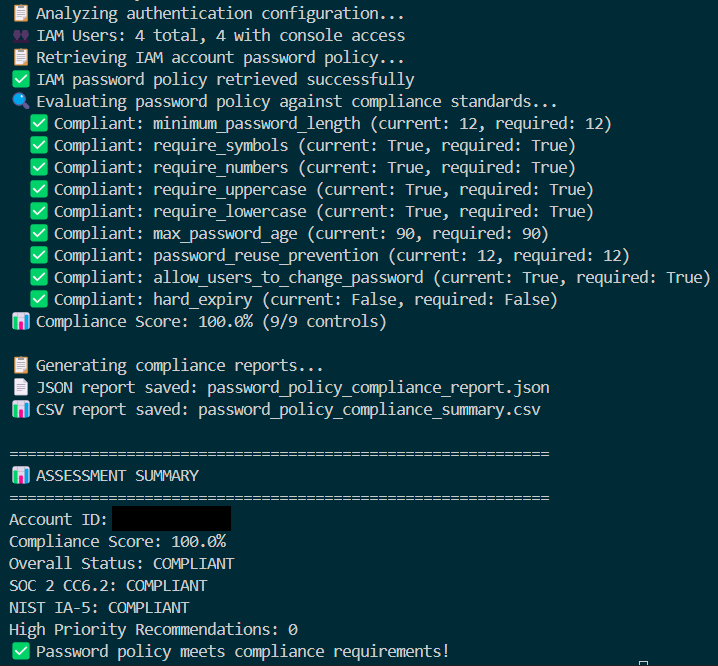

# AWS Password Policy Compliance Checker

This is a Python-based CLI tool to audit AWS account password policies against compliance standards like SOC 2 CC6.2 and NIST 800-53 IA-5. It evaluates IAM password policies, detects federated authentication via AWS Identity Center, and generates detailed JSON and CSV reports with remediation recommendations.

---

##  Overview

Many organizations rely on AWS for infrastructure, and strong password policies are a baseline requirement for securing access. This tool was developed to automate the evaluation of those policies against recognized compliance frameworks.

Key features include:
- Automatic detection of IAM vs. Identity Center authentication
- Evaluation of key controls like:
  - Password length
  - Use of symbols, numbers, and uppercase/lowercase
  - Password expiration
  - Password reuse prevention
- Scoring system and compliance status (Compliant / Partially Compliant / Non-Compliant)
- Output reports in JSON and CSV formats
- Recommendations with actionable AWS CLI commands

---

## Technologies Used

- Python 3
- Boto3 (AWS SDK for Python)
- AWS IAM & SSO APIs
- argparse (for CLI interface)
- JSON & CSV (for reporting)
- Windsurf IDE

---

## Architecture & Logic Flow

### High-Level Logic Flow


---

## Environment Setup

### 1. Set up virtual environment

#### Create and activate virtual environment:
python3 -m venv venv

#### On Windows:
venv\Scripts\activate

#### On macOS/Linux:
source venv/bin/activate

#### Install dependencies:
pip install -boto3

---

### 2.  AWS Configuration

#### Configure your AWS credentials using:
aws configure sso or aws configure

<details> <summary> <strong>Required IAM Permissions</strong> (click to expand)</summary>

```json
{
    "Version": "2012-10-17",
    "Statement": [
        {
            "Effect": "Allow",
            "Action": [
                "iam:GetAccountPasswordPolicy",
                "iam:ListUsers",
                "iam:GetLoginProfile",
                "sso:ListInstances"
            ],
            "Resource": "*"
        }
    ]
}
```
</details>

---

### 3. How to Run

python password_policy_checker.py --profile your-profile-name --region us-east-1

(Refer to link in the Resources section below for full Python code for password_policy_checker.py)

### Example code snippets

Below are select sections of Python code that demonstrate how the tool is designed and structured. These blocks highlight the class setup, core logic, and command-line interface integration.

#### Class initialization & compliance standards

This snippet shows how the tool initializes with AWS profile support and defines strict baseline standards for password compliance.

<details> <summary> View Code</summary>

```python
def __init__(self, profile_name=None, region='us-east-1'):
    self.profile_name = profile_name
    self.region = region
    self.session = None
    self.iam_client = None
    self.account_id = None
    self.compliance_standards = {
        'minimum_password_length': 12,
        'require_symbols': True,
        'require_numbers': True,
        'require_uppercase': True,
        'require_lowercase': True,
        'max_password_age': 90,
        'password_reuse_prevention': 12,
        'allow_users_to_change_password': True,
        'hard_expiry': False
    }
```
</details>

#### Core logic: evaluating compliance

These snippets contains the core logic that compares the current AWS account password policy to SOC 2 and NIST controls, and calculates a compliance score. 

<details> <summary> View Code</summary>

```python
def evaluate_policy_compliance(self, policy):
    print("Evaluating password policy against compliance standards...")
    evaluation = {
        'compliant_controls': [],
        'non_compliant_controls': [],
        'missing_controls': [],
        'compliance_score': 0,
        'soc2_cc6_2_status': 'UNKNOWN',
        'nist_ia_5_status': 'UNKNOWN',
        'overall_status': 'UNKNOWN',
        'policy_type': 'unknown'
    }

    if policy is None:
        evaluation['missing_controls'] = list(self.compliance_standards.keys())
        evaluation['overall_status'] = 'NON_COMPLIANT'
        return evaluation

# ... loop through controls and compare

    total_controls = len(self.compliance_standards)
    compliant_count = 0
    for control, required_value in self.compliance_standards.items():
        current_value = policy.get(control)
        if current_value is None:
            evaluation['missing_controls'].append(control)
        elif self._is_control_compliant(control, current_value, required_value):
            evaluation['compliant_controls'].append(control)
            compliant_count += 1
        else:
            evaluation['non_compliant_controls'].append(control)

    evaluation['compliance_score'] = round((compliant_count / total_controls) * 100, 2)
    evaluation['overall_status'] = 'COMPLIANT' if evaluation['compliance_score'] >= 90 else 'NON_COMPLIANT'

    return evaluation
```

</details>

#### CLI entry point (main() function)

This function enables the script to be run from the terminal with optional AWS profile and region flags, making it a real CLI tool.

<details> <summary> View Code</summary>

```python
def main():
    parser = argparse.ArgumentParser(
        description='AWS Password Policy Compliance Checker'
    )
    parser.add_argument('--profile', type=str, help='AWS profile to use')
    parser.add_argument('--region', type=str, default='us-east-1', help='AWS region')
    args = parser.parse_args()
    
    checker = PasswordPolicyChecker(profile_name=args.profile, region=args.region)
    success = checker.run_assessment()
    sys.exit(0 if success else 1)
```
</details>

---

### 4. Reports & Output Files

After running the code, you'll get three reports:

- Report output in your CLI (compliant and non-compliant examples below)
- JSON report (non-compliant sample output below)
- CSV report (non-compliant sample output below)

<details> <summary> <strong>Sample CLI output showing compliance</strong> (click to expand)</summary>



</details>

<details> <summary> <strong>Sample CLI output showing non-compliance</strong> (click to expand)</summary>


</details>

<details> <summary> <strong>Sample JSON screenshot showing non-compliance</strong> (click to expand)</summary>


</details>

<details> <summary> <strong>Sample CSV screenshot showing non-compliance</strong> (click to expand)</summary>
  


</details>

---

## Design Considerations

| Design Element | Why It Matters |
|----------------|----------------|
| Federated vs IAM Detection | The tool detects both Identity Center (SSO) and traditional IAM to avoid false evaluations. |
| Standards Mapping | All policy checks align with SOC 2 CC6.2 and NIST 800-53 IA-5, enabling real-world audit alignment. |
| Flexible AWS Profiles | Supports CLI arguments (`--profile`, `--region`) for testing multiple environments easily. |
| Report Formats | Output in JSON for automation and CSV for stakeholders or documentation. |
| CLI Recommendations | Each failing control includes a command to fix it directly using AWS CLI. |

---

## What I Learned

- How to interact with AWS via Python using boto3
- Real-world compliance auditing and security policy evaluation
- Differences between IAM and SSO authentication in AWS
- How to structure a scalable, testable CLI Python application
- Best practices for automated reporting and compliance remediation

---

## Resources

- [Password Policy Verification](https://www.patreon.com/posts/137803768?collection=1606822)
- [GRC Engineering](https://grcengineeringbook.com/)
