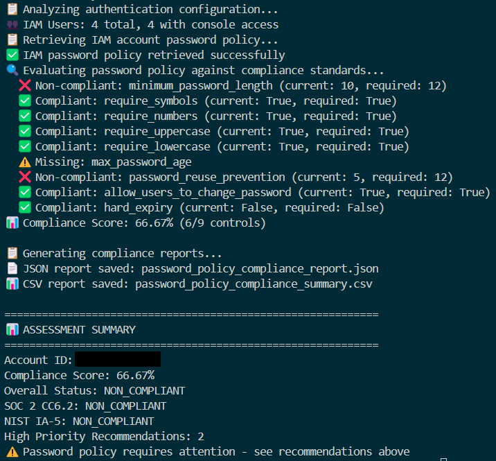

# AWS Password Policy Compliance Checker

Automate NIST 800-53 and SOC 2 password control validation in AWS using Python & Boto3.

---

## About this project

This project demonstrates how GRC engineering can automate AWS compliance assessments. It evaluates AWS password policies, detects whether the account uses IAM-managed credentials or federated (SSO) authentication, and generates compliance evidence aligned with NIST 800-53 IA-5 and SOC 2 CC6.2.

> **Why this matters**:
> It bridges compliance frameworks and cloud security operations by producing structured, audit-ready evidence.

---

## Overview

| Area                      | Description                                                              |
| ------------------------- | ------------------------------------------------------------------------ |
| **Purpose**               | Evaluate AWS password policies against SOC 2 and NIST standards          |
| **Focus**                 | Detect IAM vs SSO accounts, assess policy controls, and score compliance |
| **Tech Stack**            | Python • Boto3 • argparse • JSON & CSV • AWS IAM & SSO APIs              |
| **Key Outcome**           | JSON and CSV compliance reports + CLI recommendations for remediation    |
| **Compliance Frameworks** | SOC 2 CC6.2, NIST 800-53 IA-5                                            |
| **Target Users**          | Security, compliance, and cloud governance teams                         |

---

## Architecture & Logic Flow


---

## Quick Start

### 1. Set up your Python virtual environment

```bash
python3 -m venv venv
source venv/bin/activate        # macOS/Linux
venv\Scripts\activate           # Windows
pip install boto3

# or, for repeatable environment (recommended for teams or GitHub projects):
pip install -r requirements.txt
```
> `requirements.txt` ensures everyone working with the project installs the exact same dependencies and versions which is useful for consistency and automation pipelines.

### 2.  Configure AWS credentials

#### Configure your AWS credentials using:
```bash 
aws configure sso
# or 
aws configure
```

<details> <summary> <strong>Required IAM Permissions</strong> (click to expand)</summary>

```json
{
    "Version": "2012-10-17",
    "Statement": [
        {
            "Effect": "Allow",
            "Action": [
                "iam:GetAccountPasswordPolicy",
                "iam:ListUsers",
                "iam:GetLoginProfile",
                "sso:ListInstances"
            ],
            "Resource": "*"
        }
    ]
}
```
</details>

### 3. Run the checker
```bash
python password_policy_checker.py --profile your-profile-name --region us-east-1
```
(Refer to link in the Resources section below for full Python code for password_policy_checker.py)

---

## How it works

1. Initializes a session using the specified AWS profile and region.
2. Detects whether users are IAM or federated (Identity Center/SSO).
3. Retrieves current password policies.
4. Compares policies against compliance baselines:
    - Minimum password length
    - Use of symbols, numbers, uppercase/lowercase
    - Password expiration
    - Password reuse prevention
5. Calculates a compliance score and overall status.
6. Outputs JSON and CSV reports.
7. Provides CLI-based remediation commands for non-compliant controls.

All operations are fully automated, requiring no manual console checks.

---

## Core Components

| Component                        | Description                                                                    |
| -------------------------------- | ------------------------------------------------------------------------------ |
| **PasswordPolicyChecker**        | Initializes AWS session, retrieves IAM policies, and manages compliance logic  |
| **evaluate_policy_compliance()** | Evaluates current AWS password policy against SOC 2 / NIST baselines           |
| **CLI Entry Point**              | `main()` function handles argument parsing and runs the compliance assessment  |
| **Reports**                      | Generates JSON (automation) and CSV (stakeholder) compliance outputs           |

---

### Example code snippets
*Note: Refer to the [Resources](#resources) section below for the full Python script.*

Below are select sections of Python code that demonstrate how the tool is designed and structured. These blocks highlight the class setup, core logic, and command-line interface integration.

#### 1. Class initialization & compliance standards

This snippet shows how the tool initializes with AWS profile support and defines strict baseline standards for password compliance.

<details> <summary> View Code</summary>

```python
def __init__(self, profile_name=None, region='us-east-1'):
    self.profile_name = profile_name
    self.region = region
    self.session = None
    self.iam_client = None
    self.account_id = None
    self.compliance_standards = {
        'minimum_password_length': 12,
        'require_symbols': True,
        'require_numbers': True,
        'require_uppercase': True,
        'require_lowercase': True,
        'max_password_age': 90,
        'password_reuse_prevention': 12,
        'allow_users_to_change_password': True,
        'hard_expiry': False
    }
```
</details>

#### 2. Core logic: evaluating compliance

These snippets contain the core logic that compares the current AWS account password policy to SOC 2 and NIST controls, and calculates a compliance score. 

<details> <summary> View Code</summary>

```python
def evaluate_policy_compliance(self, policy):
    print("Evaluating password policy against compliance standards...")
    evaluation = {
        'compliant_controls': [],
        'non_compliant_controls': [],
        'missing_controls': [],
        'compliance_score': 0,
        'soc2_cc6_2_status': 'UNKNOWN',
        'nist_ia_5_status': 'UNKNOWN',
        'overall_status': 'UNKNOWN',
        'policy_type': 'unknown'
    }

    if policy is None:
        evaluation['missing_controls'] = list(self.compliance_standards.keys())
        evaluation['overall_status'] = 'NON_COMPLIANT'
        return evaluation

# Analysis logic continues... (truncated for brevity)

    total_controls = len(self.compliance_standards)
    compliant_count = 0
    for control, required_value in self.compliance_standards.items():
        current_value = policy.get(control)
        if current_value is None:
            evaluation['missing_controls'].append(control)
        elif self._is_control_compliant(control, current_value, required_value):
            evaluation['compliant_controls'].append(control)
            compliant_count += 1
        else:
            evaluation['non_compliant_controls'].append(control)

    evaluation['compliance_score'] = round((compliant_count / total_controls) * 100, 2)
    evaluation['overall_status'] = 'COMPLIANT' if evaluation['compliance_score'] >= 90 else 'NON_COMPLIANT'

    return evaluation
```

</details>

#### 3. CLI entry point (main() function)

This function enables the script to be run from the terminal with optional AWS profile and region flags, making it a real CLI tool.

<details> <summary> View Code</summary>

```python
def main():
    parser = argparse.ArgumentParser(
        description='AWS Password Policy Compliance Checker'
    )
    parser.add_argument('--profile', type=str, help='AWS profile to use')
    parser.add_argument('--region', type=str, default='us-east-1', help='AWS region')
    args = parser.parse_args()
    
    checker = PasswordPolicyChecker(profile_name=args.profile, region=args.region)
    success = checker.run_assessment()
    sys.exit(0 if success else 1)
```
</details>

---

## Reports & Output Files

After running the code, you'll get three reports:

- Report output in your CLI (compliant and non-compliant examples below)
- JSON report (non-compliant sample output below)
- CSV report (non-compliant sample output below)

**1. Sample CLI output showing compliance**


**2. Sample CLI output showing non-compliance**



**3. Sample JSON screenshot showing non-compliance**


**4. Sample CSV screenshot showing non-compliance**
  


---

## Compliance Context

| Framework            | Relevant Domains                | Description                                                                |
| -------------------- | ------------------------------- | -------------------------------------------------------------------------- |
| **SOC 2 CC6.2**      | Logical Access Controls         | Evaluates whether user authentication mechanisms enforce strong passwords  |
| **NIST 800-53 IA-5** | Identification & Authentication | Defines password complexity, expiration, and reuse prevention requirements |

---

## Governance & Security

- IAM permissions follow least-privilege principles
- Reports include actionable remediation steps
- JSON reports support automation and auditing
- CLI workflow reduces manual errors and ensures repeatability

---

## What I Learned

- How to interact with AWS via Python using boto3
- Real-world compliance auditing and security policy evaluation
- Differences between IAM and SSO authentication in AWS
- How to structure a scalable, testable CLI Python application
- Best practices for automated reporting and compliance remediation

---

## Resources

- [Password Policy Verification](https://www.patreon.com/posts/137803768?collection=1606822)
- [GRC Engineering](https://grcengineeringbook.com/)
